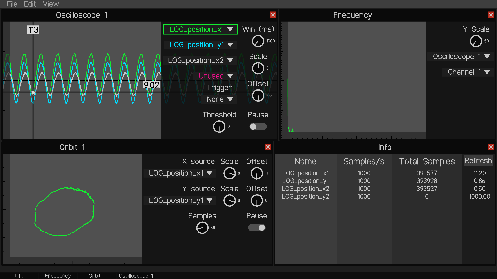
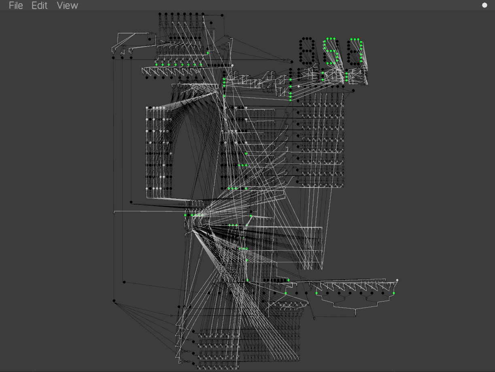

# Turtle Libraries

The turtle libraries are a set of openGL libraries written in C that add functionality similar to the [python turtle graphics library](https://docs.python.org/3/library/turtle.html). These libraries also include other functionality including the ability to write text, interact with the file system, and common UI elements.

The combination of functions that the turtle libraries provide make it ideal for lightweight GUI applications such as [EMPV](https://github.com/Severson-Group/EMPV) or [logicgates](https://github.com/Known4225/Logic-Gates-OpenGL).

## Turtle

turtle allows you to use openGL to draw on an application window like a canvas. Using `turtleGoto()`, `turtlePenDown()`, and `turtlePenUp()`, objects can be drawn on the screen. Turtle can also directly "blit" shapes to the screen using `turtleCircle()` and `turtleQuad()`. Turtle also includes functionality to detect keyboard and mouse clicks, using the `turtleKeyPressed()` and `turtleMouseDown()` functions.

## TurtleTextures

a version of turtle that allows textures to be loaded and rendered on the screen

## TurtleText

turtleText extends the functionality of turtle to allow text to be drawn to the screen using the `turtleTextWriteString()` and `turtleTextWriteUnicode()` functions. A custom font file `fontBez.tgl` is included with the project which supports the latin, greek, and cyrillic alphabets as well as a variety of common characters.

## TurtleTools

turtleTools contains many different UI elements including dropdowns, dials, sliders, switches, and buttons.

## osTools

osTools contains file dialog, clipboard, and other operating system integration tools.
