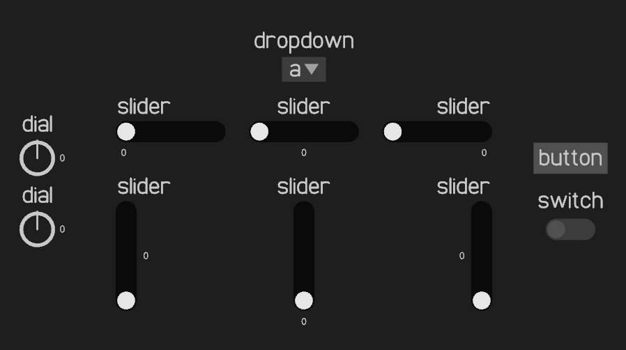

# Turtle Libraries

The turtle libraries are a set of openGL libraries written in C that add functionality similar to the [python turtle graphics library](https://docs.python.org/3/library/turtle.html). These libraries also include other functionality including the ability to write text, interact with the file system, and basic UI elements.

The turtle toolset only works on windows and linux. It uses the [glfw window library](https://www.glfw.org/), the [glad opengl loader](https://glad.dav1d.de/), and [stb_image and stbi_resize2](https://github.com/nothings/stb) for image rendering.

The combination of functions that the turtle libraries provide make it ideal for lightweight GUI applications such as [EMPV](https://github.com/Severson-Group/EMPV) or [logicgates](https://github.com/Known4225/Logic-Gates-OpenGL).


# How to use

See the [wiki](https://github.com/Known4225/turtle/wiki/Building-a-project-with-turtle) for detailed information on how to build a project with turtle.

The turtle libraries uses the [singlefile header implementation](https://github.com/r-lyeh/single_file_libs). To use in your projects, include it with:

```C
#define TURTLE_IMPLEMENTATION
#include "turtle.h"
```

Only define this macro `TURTLE_IMPLEMENTATION` in one file.

Additionally, turtle can be used as a precompiled library. To make this library, run `make winlib` on windows (or `make lib` on linux). It can then be linked in your project, with no need to ever `#define TURTLE_IMPLEMENTATION`. Binaries for these libraries for windows (64-bit) and linux (x86-64) are in the `Windows/` and `Linux/` folders respectively (as well as necessary binaries for the glfw and glad libraries for these platforms).

# Modules

The turtle libraries are separated into distinct modules

## Unitype list

list is an implementation of resizable lists, similar to the way lists in python work. You're able to add many C primitive types to this list including integers, floats, and strings. Use functions like `list_init()`, `list_append()`, and `list -> data[index].d`.

## Turtle

turtle allows you to use openGL to draw on an application window like a canvas. Using `turtleGoto()`, `turtlePenDown()`, and `turtlePenUp()`, objects can be drawn on the screen. Turtle can also directly "blit" shapes to the screen using `turtleCircle()`, `turtleQuad()`, and `turtleTexture()`. Turtle also includes functionality to detect keyboard and mouse clicks, using the `turtleKeyPressed()` and `turtleMouseDown()` functions.

## TurtleText

turtleText extends the functionality of turtle to allow text to be drawn to the screen using the `turtleTextWriteString()` and `turtleTextWriteUnicode()` functions. A custom font file `roberto.tgl` is included with the project which supports the latin, greek, and cyrillic alphabets as well as a variety of common characters.

## TurtleTools

turtleTools contains many different UI elements including dropdowns, dials, sliders, switches, and buttons.



## osTools

osTools contains file dialog, clipboard, and other operating system integration tools. Additionally, support for serial ports and tcp/ip is included for windows only.

# Example project

An example project, `turtle.c` is included with the repository. The binaries for this project for windows (64-bit) and linux (x86-64) are included in the repository and can be run without dependencies. The project showcases some of turtle's features and is intended to be a guide on how to code with turtle.

The example project can be built with `make win` on windows or `make` on linux. Windows requires `gcc` and the ability to run makefiles, I recommend [w64devkit](https://github.com/skeeto/w64devkit/releases).

## Config

The example project has a set of files in the `config/` folder that can be modified to change certain aspects of the project (the font, the ribbon, and the popup). If these files are not found then default versions of these configurations are used (which happen to be identical to the ones in the `config/` folder).

# To Do
- Fix annoying bug with scrollbar hover cancelling and closing dropdown (make it so you have to click on scrollbar)
- Alignment options for switches
- Upward dropdown
- Logarithmic and Exponential sliders
- List stride sort
- Cleanup Win32Tcp
- Write wiki/documentation
- Fix flipped world coordinates
- Linux COM and TCP/IP support

# License (MIT)

Permission is hereby granted, free of charge, to any person obtaining a copy of this software and associated documentation files (the “Software”), to deal in the Software without restriction, including without limitation the rights to use, copy, modify, merge, publish, distribute, sublicense, and/or sell copies of the Software, and to permit persons to whom the Software is furnished to do so, subject to the following conditions:

The above copyright notice and this permission notice shall be included in all copies or substantial portions of the Software.

THE SOFTWARE IS PROVIDED “AS IS”, WITHOUT WARRANTY OF ANY KIND, EXPRESS OR IMPLIED, INCLUDING BUT NOT LIMITED TO THE WARRANTIES OF MERCHANTABILITY, FITNESS FOR A PARTICULAR PURPOSE AND NONINFRINGEMENT. IN NO EVENT SHALL THE AUTHORS OR COPYRIGHT HOLDERS BE LIABLE FOR ANY CLAIM, DAMAGES OR OTHER LIABILITY, WHETHER IN AN ACTION OF CONTRACT, TORT OR OTHERWISE, ARISING FROM, OUT OF OR IN CONNECTION WITH THE SOFTWARE OR THE USE OR OTHER DEALINGS IN THE SOFTWARE.
